# 期末實作 — 412350182 張起睿

## 1. 架構總覽

本專案實作了一個具備縱深防禦（Defense in Depth）架構的雙層容器化 Web 應用程式。主機環境採用 Host-only 純內網隔離，Web 服務與後端資料庫透過 Docker 內部橋接網路進行安全通訊。整體組態全面實施最小權限原則、唯讀根目錄保護與核心級核心資源上限壓制。

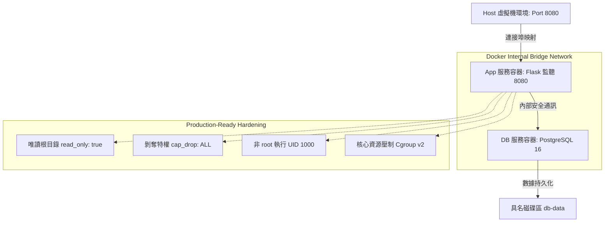
## 2. Part A：底座與基準點

本實驗環境基於全新克隆之精簡版 Ubuntu 作業系統。在切換至純內網模式前，已預先部署符合現代化容器規範之基礎引擎，並確保核心版本與工具組皆達到考卷指定之安全基準（Docker 引擎 $\ge$ 20.10，Docker Compose $\ge$ v2.x）。

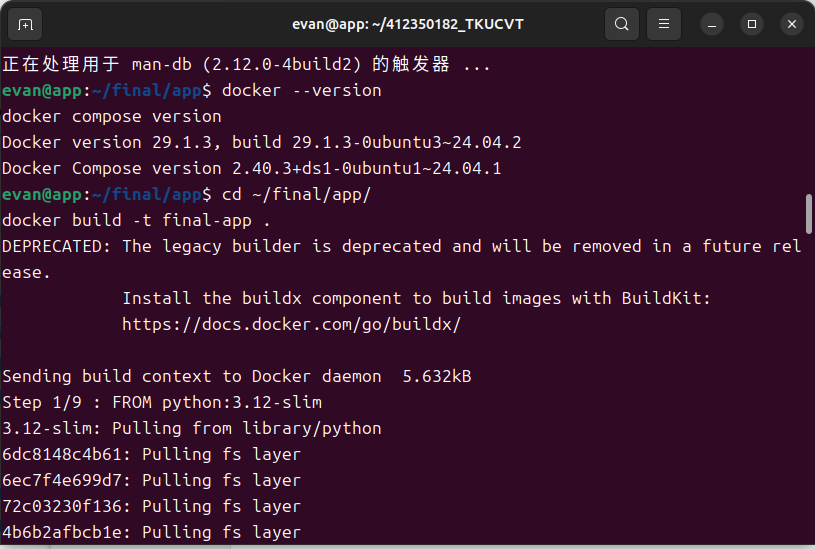

---

## 3. Part B：Dockerfile 與快取

為了符合生產級安全規範並極大化編譯效率，本專案之 `Dockerfile` 採取**快取結構最佳化**與**非特權安全階梯**雙重設計：

* **快取極大化**：將不常變動的 `requirements.txt` 宣告優先複製並執行 `pip install`，將高頻率變動的 `app.py` 原始碼留至最後一層，確保程式碼修改時能完全命中前層快取。
* **非 root 執行**：預先建立 UID/GID 為 1000 的 `appuser` 系統帳號，並在映像檔封裝末端強制執行 `USER appuser` 切換。

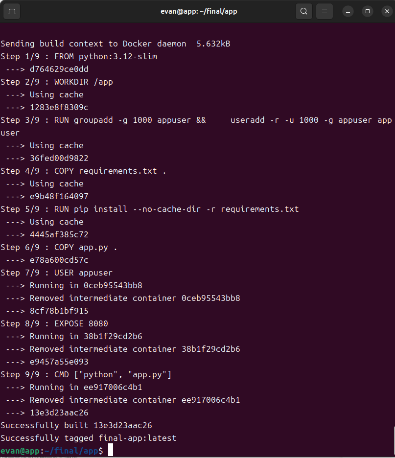

### 💡 核心問答：為什麼聽 8080 不聽 80？
在 Linux 核心安全模型中，**小於 1024 的連接埠（如 HTTP 標準埠 80）被定義為特權埠（Privileged Ports）**，只有具備 `CAP_NET_BIND_SERVICE` 特權的 `root` 使用者才能進行綁定（Bind）。

本專案嚴格遵循最小權限原則，容器在執行時期已切換為非 root 的 `appuser`，且被全面剥奪了 Linux 核心特權（`cap_drop: ALL`）。為了讓無特權使用者能順利啟動網頁服務，必須選擇大於 1024 的一般非特權埠（如 `8080`）進行監聽，隨後再透過 Docker Daemon 在 Host 端進行 Port-forwarding 對外映射。

---

## 4. Part C：Compose 與資料持久化

多容器控制採用 `compose.yaml` 進行宣告式管理。為解決傳統微服務架構中「資料庫尚未熱機完成，Web 端即因連線失敗而崩潰」的非同步啟動痛點，本專案利用 PostgreSQL 原生工具 `pg_isready` 實作主動式健康檢查（Healthcheck），並結合 `depends_on.condition: service_healthy` 機制，強迫 `app` 服務必須等待資料庫完全就緒後方可建立。

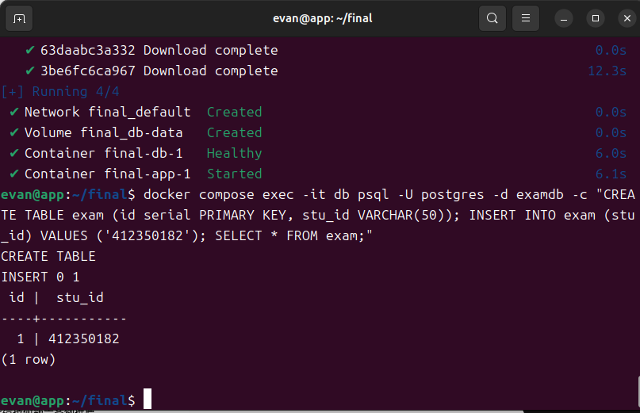
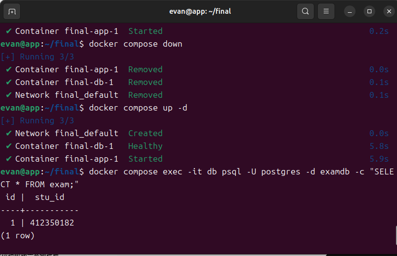
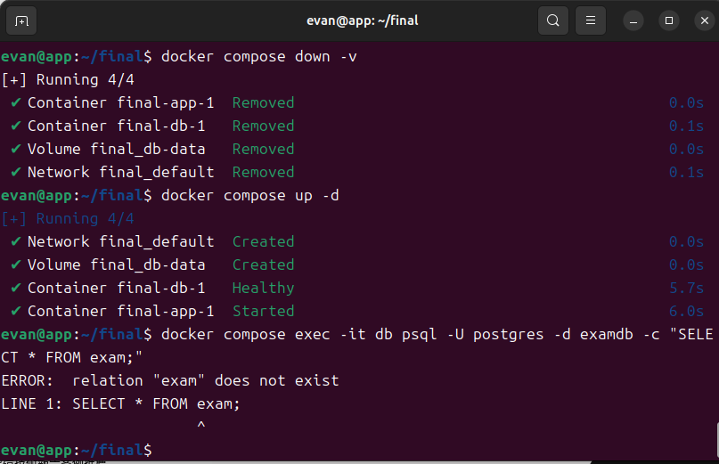

### 💡 核心問答：down vs down -v 的本質差異
* **`docker compose down`**：屬於標準的環境關閉指令。它會停止並移除所有執行中的容器、釋放建立的虛擬網路（Network），但會**完整保留具名磁碟區（Named Volumes）**。這符合資料持久化原則，當環境重啟時，資料依舊萬歲。
* **`docker compose down -v`**：屬於毀滅性清除指令。除了移除容器與網路外，它會**連同該項目掛載的所有具名磁碟區一併強制抹除**。存在 `db-data` 內的所有 PostgreSQL 實體檔案、使用者資料表將被徹底摧毀，無法復原。

---

## 5. Part D：生產化加固

生產環境透過 `compose.yaml` 配置四類最高規格加固參數，實施縱深防禦：

1. **日誌防護（Log Rotation）**：限制單一容器日誌最大容量為 `10m`，最多保留 `3` 個歷史檔案，防止阻斷服務攻擊（DoS）將硬碟空間塞爆。
2. **核心資源限制（Resource Limits）**：限制記憶體 256m、CPU 使用率 0.5、最大行程數 200，遏止容器內程式碼異常或遭勒索軟體控制時榨乾 Host 端硬體資源。
3. **權限階梯剝奪（Security Privileges）**：啟用 `read_only: true` 封鎖容器根目錄寫入權限，僅開放 `/tmp` 記憶體暫存區；加入 `no-new-privileges:true` 阻斷任何 SUID 提權路徑；透過 `cap_drop: ALL` 拔除全部核心特權。
4. **原生健康檢查**：相容於精簡型 `slim` 映像檔，改用 Python 內建之 `urllib` 模組對內部 `/healthz` 端點實施無工具依賴健康監測。

### 📊 核心取證與 Linux Kernel cgroup 讀值對照表

當容器在 Linux 主機上運作時，Docker 配置的限制會直接被寫入 Linux 核心的 `cgroup (Control Groups) v2` 虛擬檔案系統中。以下為 Host 端實體核心讀值與 YAML 設定之精確對照：

| 資源項目 | Compose YAML 設定值 | Linux 核心實體控制檔案路徑 | 核心內存實體讀值 (Bytes / Quota) | 核心取證科學原理說明 |
| :--- | :--- | :--- | :--- | :--- |
| **記憶體上限** | `mem_limit: 256m` | `/sys/fs/cgroup/.../memory.max` | `268435456` | $256 \times 1024 \times 1024 = 268435456$ 位元組，證明核心嚴格實施記憶體上限壓制。 |
| **CPU 配額** | `cpus: "0.5"` | `/sys/fs/cgroup/.../cpu.max` | `50000 100000` | 代表在每 100ms (`100000` μs) 週期內，該容器最多只能分配 `50000` μs 的 CPU 時間，比例即為精確的 `0.5` 核。 |
| **行程上限** | `pids_limit: 200` | `/sys/fs/cgroup/.../pids.max` | `200` | 限制該 cgroup 分支下最多只能分支出 200 個獨立 Thread/Process，防止 Fork Bomb 攻擊。 |

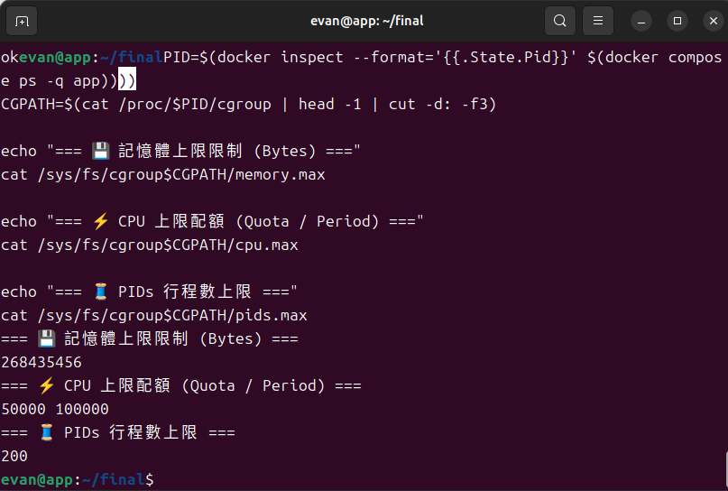

---

## 6. 反思

這學期從最底層的虛擬機作業系統配置，一路推進到生產級安全容器的封裝維運，我深刻體會到**「隔離（Isolation）」**絕非單一維度的技術，而是一套跨越系統階層的**縱深防禦哲學**：

* **VM（虛擬機）**：屬於**硬體級的超強隔離**。它透過 Hypervisor 對 CPU、記憶體與硬體網卡進行物理性的切分，擁有完全獨立的核心（Kernel）。它防範的是不同作業系統租戶之間的惡意穿透，但缺點是資源損耗極大。
* **Namespace（命名空間）**：屬於**核心級的視覺隔離**。多個容器共享同一個主機核心，但核心透過 PID, Net, Mount 等空間切分，讓容器以為自己獨佔了整台电脑。它防範的是行程（Process）之間的越界干擾與窺探。
* **Cgroup（控制群組）**：屬於**核心級的資源審計**。Namespace 讓容器看不見別人，但如果容器內程式碼暴走，依然會搶光主機的 CPU。Cgroup 則是從底層調配硬體配額，防範的是因資源搶奪導致的系統級崩潰（DoS）。
* **權限階梯（Non-root & Cap Drop）**：屬於**應用程式層級的最小權限限縮**。前三者都是作業系統大門的鎖，而權限階梯則是假設「如果應用程式真的被骇客攻破了怎麼辦？」。透過非 root 執行與特權剥奪，即使駭客拿到了 Flask 的控制權，他在唯讀的檔案系統與毫無 Capabilities 的核心限制下，也完全無法提權，更無法對 Host 主機造成任何傷害。

這四種隔離技術環環相扣，從外部硬體、作業系統邊界、硬體配額到內部使用者權限，共同構築了不可攻破的現代雲原生安全堡壘。

---

## 7. 故障演練

### 🛠️ 故障 1：【F1】資料庫認證損毀（環境變數密碼不一致）

* **注入方式**：修改 `.env` 檔案中 `POSTGRES_PASSWORD` 之內部數值，故意在正確密碼後方加入錯誤字串 `123`，導致前後端認證不對稱。
* **故障前**：執行 `curl -i http://localhost:8080/` 能夠正常取得學生學號資訊與 PostgreSQL 核心時間，連線完全暢通。
    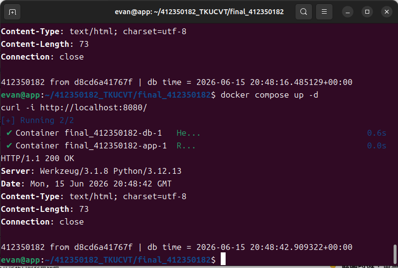
* **故障中**：執行 `docker compose up -d` 後，`app` 服務容器無法進入 healthy 狀態。透過 `docker compose logs app` 進行高階取證，日誌噴出：`psycopg2.OperationalError: password authentication failed for user "postgres"`，隨後容器崩潰中斷。
    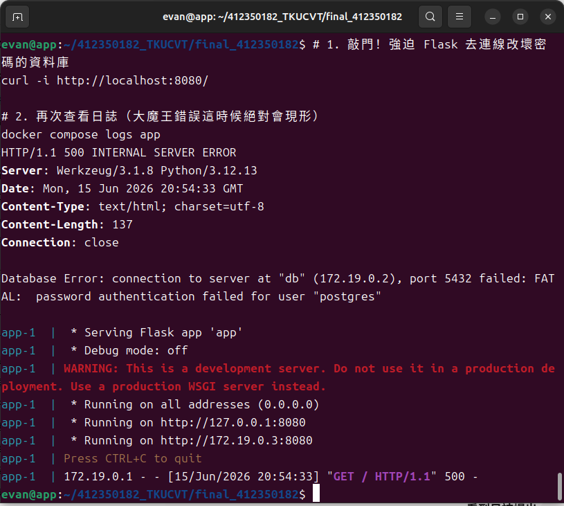
* **回復後**：修正 `.env` 檔案恢復原創密碼，執行 `docker compose down && docker compose up -d` 重啟，網頁端再度回復 200 OK 狀態。
    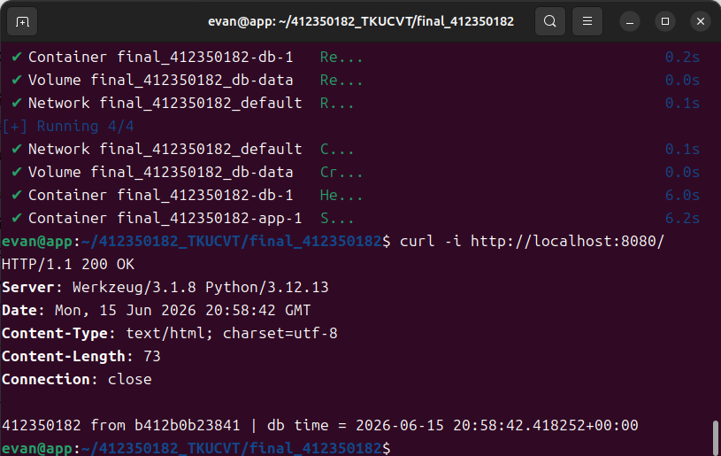
* **診斷推論**：Flask 網頁框架在啟動或呼叫根路由時，會透過 `psycopg2` 驅動向指定之資料庫進行 TCP 三向交握與身份驗證。當環境變數傳遞之密碼不匹配時，資料庫會拒絕傳輸層後續的連線請求並丟出認證異常，由於程式碼內部有針對異常進行捕獲與中斷設計，故導致容器因未捕獲運行行程而中止。

### 🛠️ 故障 2：【F2】主機連接埠衝突（Port Allocation Collision）

* **注入方式**：先將容器全面關閉，直接在 Linux Host 主機本地端執行 `python3 -m http.server 8080 &`，強行佔用主機的 `8080` 連接埠。
* **故障前**：`app` 容器尚未拉起，本地 8080 埠處於閒置狀態，或是原容器能正常獨立提供網頁連線。
    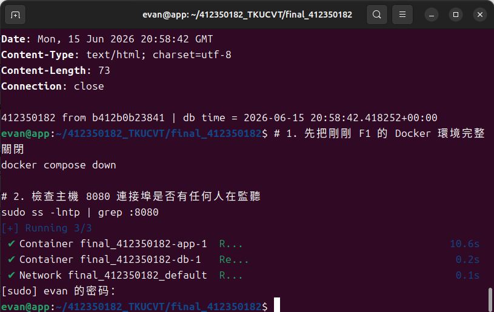
* **故障中**：嘗試執行 `docker compose up -d`，終端機立刻噴出大範圍紅色錯誤：`Bind for 0.0.0.0:8080 failed: port is already allocated`，`app` 容器因無法進行網路映射而宣告宣告建立失敗。
    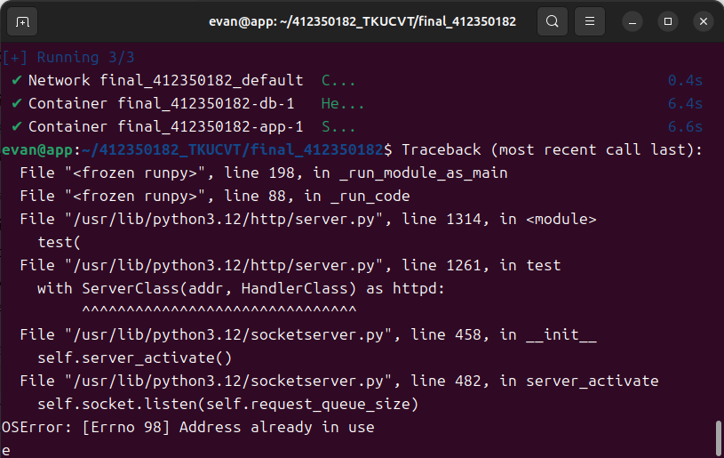
* **回復後**：在 Host 端執行排錯指令 `sudo ss -lntp | grep :8080` 揪出佔用 8080 埠的行程 PID，使用 `sudo kill` 強制超渡該本地行程。重新執行 `docker compose up -d`，容器瞬間復活，順利回歸正常運作。
    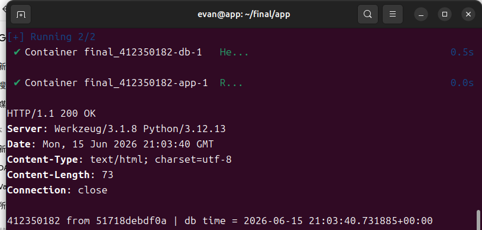
* **診斷推論**：根據網路傳輸層（TCP）原則，同一個作業系統核心的同一個 IP 網路介面上，同一個 Port 在同一時間只能被單一 Socket 進行 `Bind` 監聽。當 Host 本地程序捷足先登佔用 8080 埠後，Docker Daemon 便無法代表容器向核心申請該埠口的流量映射轉發，導致基礎網路層建立中斷。

### 📊 三症狀分層表（核心維運精髓）

身為專業的運維工程師，當看到客戶端噴出不同的網路錯誤時，應能一秒判斷其所屬的系統分層，並使用精準的核心指令進行破案：

| 臨床症狀 | 最可能發生的系統分層 | 第一條科學驗證與排錯命令 | 系統底層工程原理診斷說明 |
| :--- | :--- | :--- | :--- |
| **Timeout (連線超時)** | **網路層 / 防火牆邊界 (Network / Firewall Layer)** | `curl --connect-timeout 5 http://<Target_IP>:8080` 或 `ping` | 代表封包發送出去了，但是「對端毫無任何回應」或者「中途被防火牆（iptables/ufw）直接丟棄（Drop）」。封包在網路上迷路或被阻擋，導致連線端等到超時。 |
| **Connection Refused (連線被拒絕)** | **傳輸層 / 行程未啟動 (Transport Layer / Port Unbound)** | `sudo ss -lntp \| grep :8080` 或 `docker compose ps` | 代表目標主機（IP）存在，且封包順利抵達了對方的網卡，但是作業系統核心查表後發現**「本地沒有任何人（沒有行程）在監聽這個 Port」**。核心便主動回傳一個 TCP RST（重置）封包，直接拒絕連線。 |
| **HTTP 503 (Service Unavailable)** | **應用程式層 / 後端代理故障 (Application Layer / Upstream Failure)** | `docker compose logs app` | 代表網路完全暢通，TCP 三向交握完美成功，前端網頁網頁伺服器（Flask/Nginx）也順利收到了你的 HTTP 請求。但是網頁程式內部在調用後端元件（如 PostgreSQL 資料庫）時發生了不可預期的崩潰或中斷，導致網頁端只能無奈回傳 503 代碼。 |
