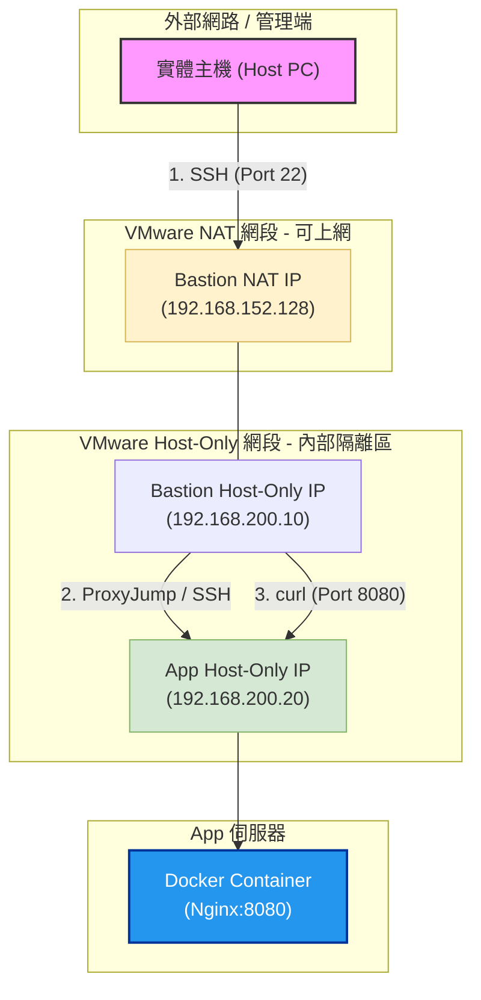

# 期中實作 — <學號> <姓名>

## 1. 架構與 IP 表
| VM | 角色 | 網卡 | 模式 | IP | 開放埠與來源 |
|---|---|---|---|---|---|
| bastion | 跳板機 | NIC 1 | NAT | 192.168.152.128 | SSH from any |
| bastion | 跳板機 | NIC 2 | Host-only | 192.168.200.128 | — |
| app | 應用層 | NIC 1 | Host-only | 192.168.200.129 | SSH from bastion |
| app | docker | — | docker | 127.0.0.1:8080 | — |

## 2. Part A：VM 與網路
evan@bastion:~$ ip -4 addr show
1: lo: <LOOPBACK,UP,LOWER_UP> mtu 65536 qdisc noqueue state UNKNOWN group default qlen 1000
    inet 127.0.0.1/8 scope host lo
       valid_lft forever preferred_lft forever
2: ens33: <BROADCAST,MULTICAST,UP,LOWER_UP> mtu 1500 qdisc fq_codel state UP group default qlen 1000
    altname enp2s1
    inet 192.168.152.128/24 brd 192.168.152.255 scope global dynamic noprefixroute ens33
       valid_lft 957sec preferred_lft 957sec
3: ens37: <BROADCAST,MULTICAST,UP,LOWER_UP> mtu 1500 qdisc fq_codel state UP group default qlen 1000
    altname enp2s5
    inet 192.168.200.128/24 brd 192.168.200.255 scope global dynamic noprefixroute ens37
       valid_lft 957sec preferred_lft 957sec
4: docker0: <NO-CARRIER,BROADCAST,MULTICAST,UP> mtu 1500 qdisc noqueue state DOWN group default 
    inet 172.17.0.1/16 brd 172.17.255.255 scope global docker0
       valid_lft forever preferred_lft forever

## 3. Part B：金鑰、ufw、ProxyJump
<防火牆規則表 + ssh app 成功證據>

## 4. Part C：Docker 服務
<systemctl status docker + curl 輸出>

## 5. Part D：故障演練
### 故障 1：<F1/F2/F3 擇一>
- 注入方式：
- 故障前：
- 故障中：
- 回復後：
- 診斷推論：

### 故障 2：<另一個>
（同上）

### 症狀辨識（若選 F1+F2 必答）
兩個都 timeout，我怎麼分？

## 6. 反思（200 字）
這次做完，對「分層隔離」或「timeout 不等於壞了」的理解有什麼改變？

## 7. Bonus（選做）
