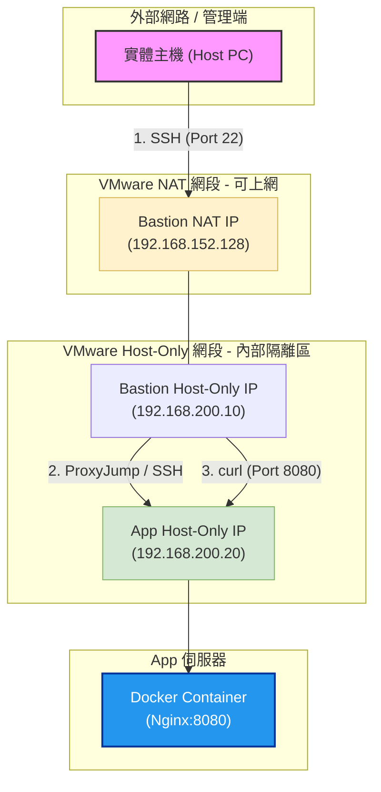
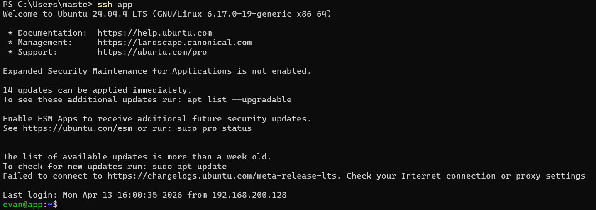
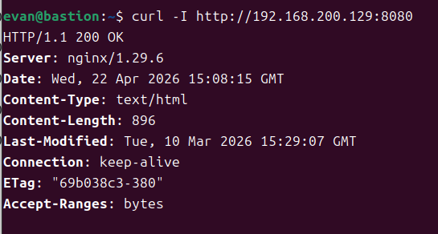
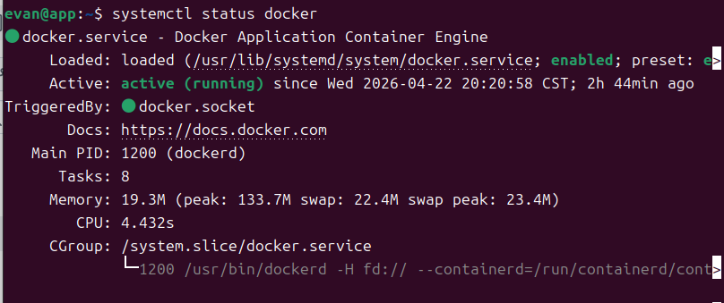
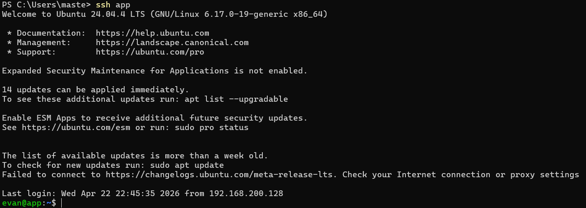
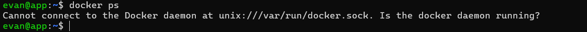
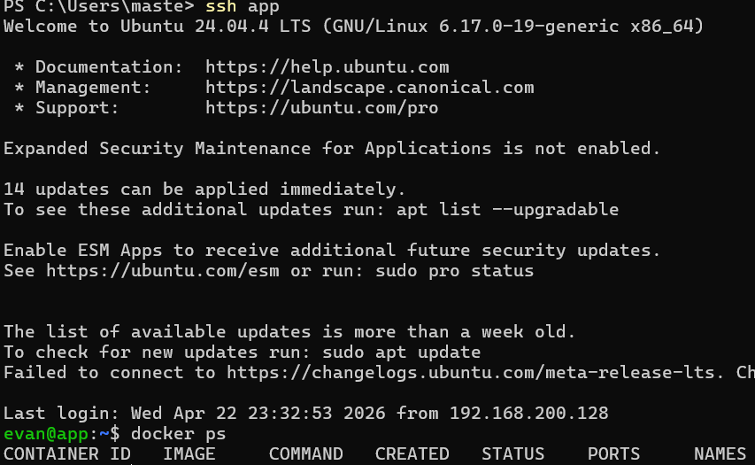
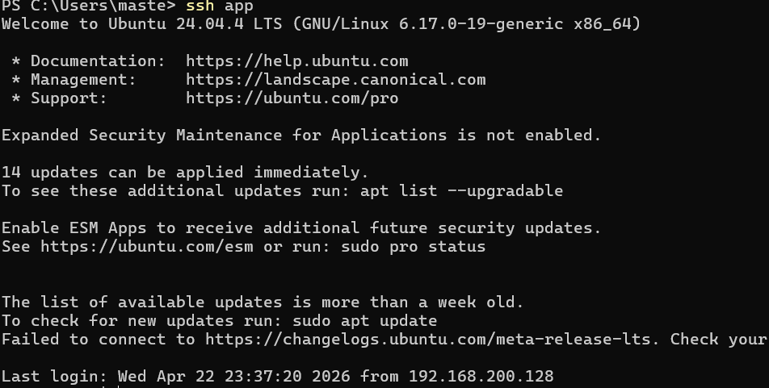
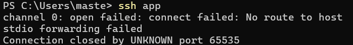
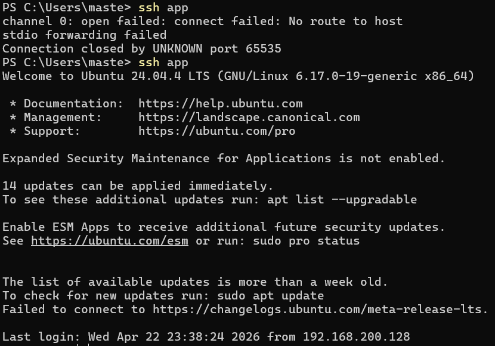

# 期中實作 — <學號> <姓名>

## 1. 架構與 IP 表
| VM | 角色 | 網卡 | 模式 | IP | 開放埠與來源 |
|---|---|---|---|---|---|
| bastion | 跳板機 | NIC 1 | NAT | 192.168.152.128 | SSH from any |
| bastion | 跳板機 | NIC 2 | Host-only | 192.168.200.128 | — |
| app | 應用層 | NIC 1 | Host-only | 192.168.200.129 | SSH from bastion |
| app | docker | — | docker | 127.0.0.1:8080 | — |

## 2. Part A：VM 與網路
evan@bastion:~$ ip -4 addr show
1: lo: <LOOPBACK,UP,LOWER_UP> mtu 65536 qdisc noqueue state UNKNOWN group default qlen 1000
    inet 127.0.0.1/8 scope host lo
       valid_lft forever preferred_lft forever
2: ens33: <BROADCAST,MULTICAST,UP,LOWER_UP> mtu 1500 qdisc fq_codel state UP group default qlen 1000
    altname enp2s1
    inet 192.168.152.128/24 brd 192.168.152.255 scope global dynamic noprefixroute ens33
       valid_lft 957sec preferred_lft 957sec
3: ens37: <BROADCAST,MULTICAST,UP,LOWER_UP> mtu 1500 qdisc fq_codel state UP group default qlen 1000
    altname enp2s5
    inet 192.168.200.128/24 brd 192.168.200.255 scope global dynamic noprefixroute ens37
       valid_lft 957sec preferred_lft 957sec
4: docker0: <NO-CARRIER,BROADCAST,MULTICAST,UP> mtu 1500 qdisc noqueue state DOWN group default 
    inet 172.17.0.1/16 brd 172.17.255.255 scope global docker0
       valid_lft forever preferred_lft forever

evan@app:~$ ip addr
1: lo: <LOOPBACK,UP,LOWER_UP> mtu 65536 qdisc noqueue state UNKNOWN group default qlen 1000
    link/loopback 00:00:00:00:00:00 brd 00:00:00:00:00:00
    inet 127.0.0.1/8 scope host lo
       valid_lft forever preferred_lft forever
    inet6 ::1/128 scope host noprefixroute 
       valid_lft forever preferred_lft forever
2: ens33: <BROADCAST,MULTICAST,UP,LOWER_UP> mtu 1500 qdisc fq_codel state UP group default qlen 1000
    link/ether 00:0c:29:fb:02:07 brd ff:ff:ff:ff:ff:ff
    altname enp2s1
    inet 192.168.200.129/24 brd 192.168.200.255 scope global dynamic noprefixroute ens33
       valid_lft 1361sec preferred_lft 1361sec
    inet6 fe80::a58d:6eb6:a8c:4f27/64 scope link noprefixroute 
       valid_lft forever preferred_lft forever
3: docker0: <NO-CARRIER,BROADCAST,MULTICAST,UP> mtu 1500 qdisc noqueue state DOWN group default 
    link/ether 8e:94:af:17:c2:16 brd ff:ff:ff:ff:ff:ff
    inet 172.17.0.1/16 brd 172.17.255.255 scope global docker0
       valid_lft forever preferred_lft forever

## 3. Part B：金鑰、ufw、ProxyJump
| VM | 規則 | 目的 |
|---|---|---|
| bastion | ALLOW 22/tcp | 允許 Host 從外部進行管理連線 |
| app | ALLOW FROM 192.168.200.10 TO ANY PORT 22 | 僅允許來自跳板機的 SSH 管理流量 |

## 4. Part C：Docker 服務

## 5. Part D：故障演練
### 故障 1：<F1/F2/F3 擇一>
- 注入方式：sudo systemctl stop docker
- 故障前：
- 故障中：
- 回復後：
- 診斷推論：SSH 能連通證明網路層與傳輸層無礙，但執行容器指令失敗。透過 systemctl status 發現服務停止，這說明故障發生在服務層，不影響底層網路。

### 故障 2：<另一個>
- 注入方式：sudo ip link set ens33 down
- 故障前：
- 故障中：
- 回復後：
- 診斷推論：網路層直接斷裂，封包無法抵達目標主機。因為實體介面被關閉，OS 不再回應任何 L3 層級的請求，導致連線請求在 Host 端發生逾時 (timeout)。

### 症狀辨識（若選 F1+F2 必答）
兩個都 timeout，我怎麼分？
  兩個故障在 Host 端均呈現 timeout，但診斷方式如下：

    先 Ping：若 ping 不通，問題通常在 L2/L3 (網路層)。這時應檢查 ip link 或路由表，因為封包根本找不到目的地。
    
    若 Ping 通但 SSH Timeout：則問題在 L4 (傳輸層/防火牆)。這時應使用 sudo ufw status 檢查，因為網路路徑是通的，但防火牆規則封鎖了連線，導致 TCP 三向交握無法完成。

## 6. 反思（200 字）
這次做完，對「分層隔離」或「timeout 不等於壞了」的理解有什麼改變？
    這次實作讓我對「連線失敗」背後的邏輯有了系統性的理解。過去我常誤以為 timeout 代表機器掛了，但在這次分層故障注入中，我學會將問題拆解為網路層、服務層與應用層。特別是透過      ProxyJump 建構跳板機後，我深刻體會到「最小暴露原則」對資安的重要性——App 被完全隔離在 Host-only 網段，僅能透過特定的跳板進行管理。這次的排錯練習證明了有效的診斷流程比      盲目重啟機器更有價值。當我們能從 ping 的反應、ss 監聽的連接埠，或是 journalctl 的日誌分析中找到蛛絲馬跡時，複雜的網路架構就不再令人恐懼。透過這種分層隔離的實驗，我現      在能更精準地判斷是網路路由被切斷，還是防火牆規則過於嚴苛，這對未來管理雲端環境將是極為關鍵的能力。
## 7. Bonus（選做）
我沒有做
