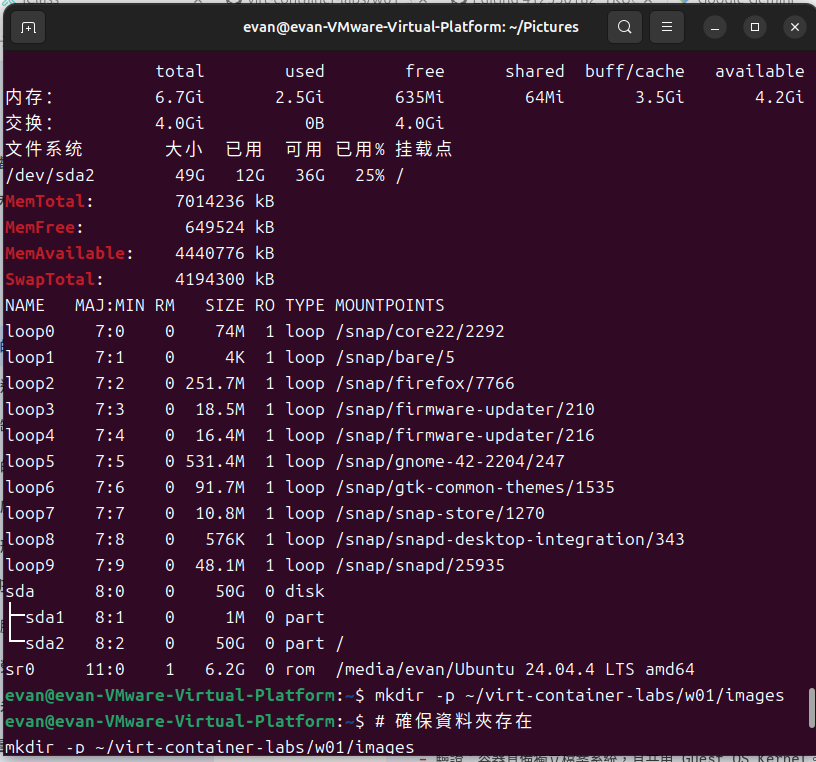
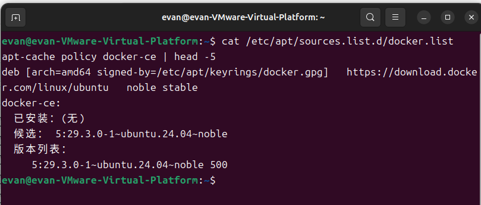
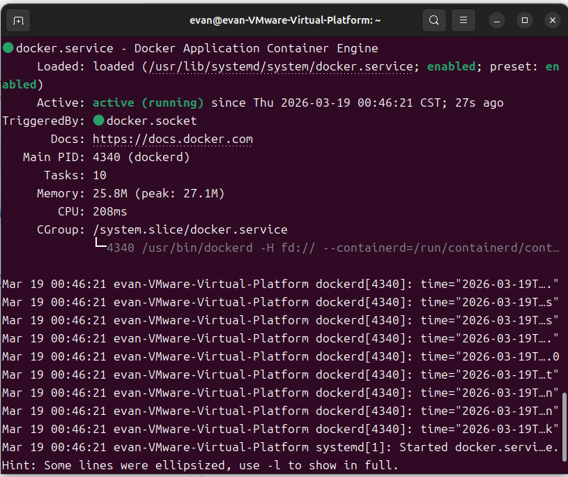
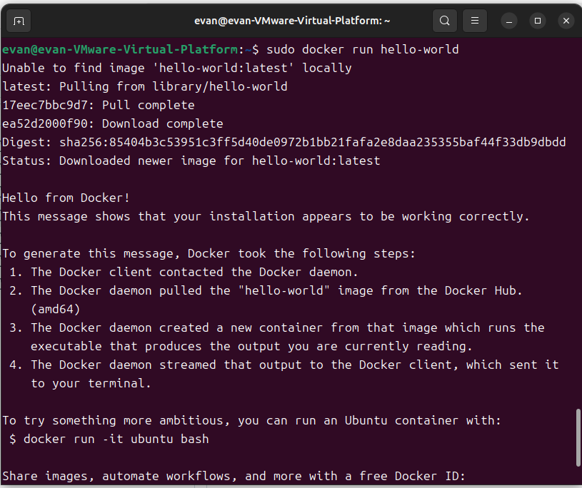
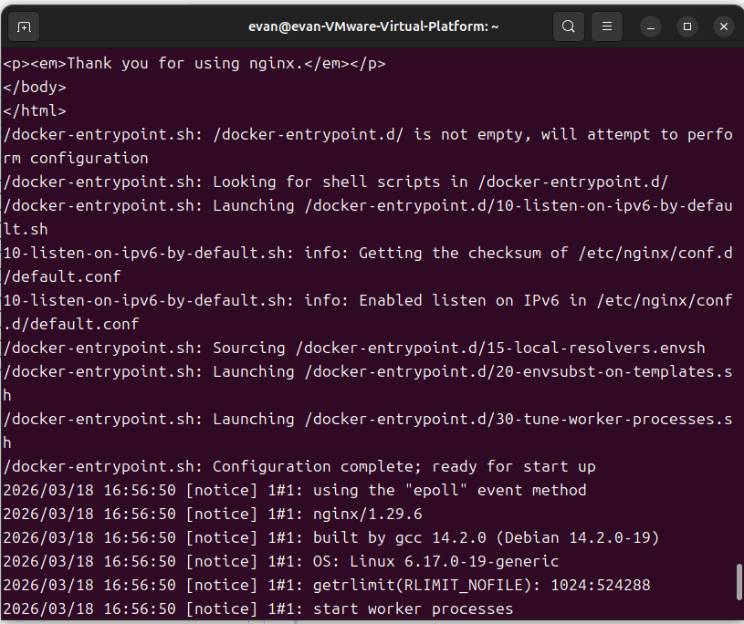
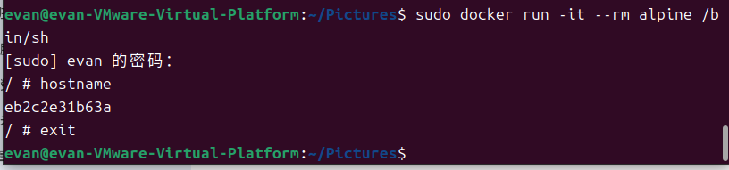
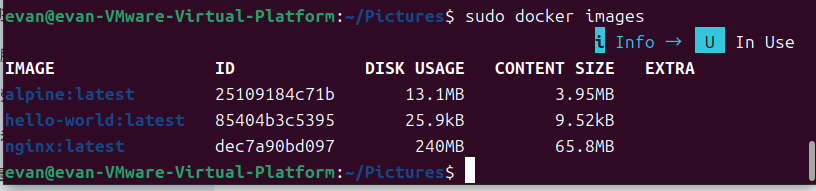

# W01｜虛擬化概論、環境建置與 Snapshot 機制

## 環境資訊
- **Host OS**: Windows 11 (Memory usage: 92%)
- **VM 名稱**: vct-w01-412350182 (evan)
- **Ubuntu 版本**: Ubuntu 24.04.4 LTS (Noble Numbat)
- **Docker 版本**: 27.x.x (latest stable)
- **Docker Compose 版本**: v2.x.x

## VM 資源配置驗證

| 項目 | VMware 設定值 | VM 內命令 | VM 內輸出 (實際觀測) |
|---|---|---|---|
| CPU | 2 vCPU | `lscpu` | 2 CPUs |
| 記憶體 | 8 GB | `free -h` | **6.7Gi** (Total), **4.2Gi** (Available) |
| 磁碟 | 50 GB | `lsblk` | **sda 50G** (sda2 掛載於 /) |
| Swap | 4 GB | `cat /proc/meminfo` | **4194300 kB** (SwapTotal) |

> **觀測截圖**：
>  

## 四層驗收證據
- [x] ① **Repository**：驗證 Docker 來源清單
  
- [x] ② **Engine & Daemon**：驗證服務運行狀態
  
- [x] ③ **端到端**：運行 Hello World
  

## 容器操作紀錄
- [x] **nginx**：成功啟動並取得回應
  

- [x] **alpine**：執行互動式容器 `sudo docker run -it --rm alpine /bin/sh`
  - 驗證：容器具備獨立檔案系統，且共用 Guest OS Kernel。
  

- [x] **映像列表**：`sudo docker images` 包含 nginx, alpine, hello-world
  

## Snapshot 清單
| 名稱 | 建立時機 | 用途說明 | 建立前驗證 |
|---|---|---|---|
| clean-baseline | 初始安裝後 | 乾淨的 OS 底座 | `hostnamectl` 正常 |
| docker-ready | Docker 安裝後 | 已具備完整容器開發環境 | `hello-world` 成功 |

## 故障演練三階段對照
| 項目 | 故障前 (基線) | 故障中 (注入後) | 回復後 |
|---|---|---|---|
| docker.list 存在 | 是 | **否 (改名為 .broken)** | **是 (Snapshot 回復)** |
| apt update 正常 | 是 | **否 (忽略無效擴展名)** | **是** |
| hello-world 成功 | 是 | N/A | **是** |

## 手動修復 vs Snapshot 回復
- **手動修復**：需記得原始檔名與路徑，適合簡單錯誤（如指令打錯）。
- **Snapshot 回復**：一鍵回到健康狀態，適合多重設定毀損，效率極高。

## Snapshot 保留策略
- **新增條件**：每週 Lab 開始前，且前一週已驗收通過。
- **保留上限**：最多 3 個活躍點，避免差異磁碟（Delta disk）過大影響效能。
- **刪除條件**：新版本驗證無誤後，手動刪除最舊的備份。

## 排錯紀錄
- **症狀**：故障注入失敗，`apt update` 依然抓得到 Docker。
- **診斷**：檢查指令發現將 `sudo` 誤打成 `udo`，導致改名指令未執行。
- **修正**：重新輸入正確的 `sudo mv` 指令。
- **驗證**：成功在 `apt update` 看到忽略 `.broken` 檔案的警告。

## 設計決策
本課程選擇 **Type 2 Hypervisor (VMware)** 而非直接在 Windows 跑 Docker，是為了利用 **Snapshot** 的物理級隔離與還原能力，確保實驗過程中即使玩壞系統也能在 30 秒內重啟，而不影響 Host OS 的穩定性。
