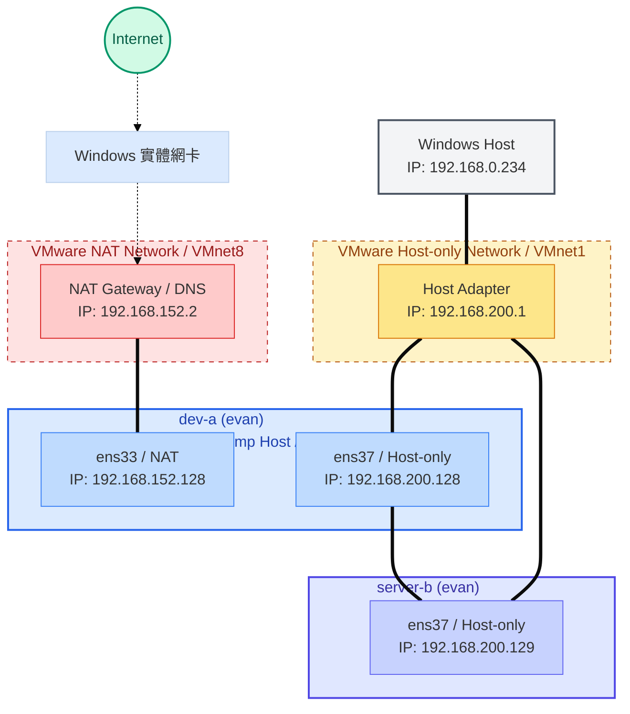

# W02｜VMware 網路模式與雙 VM 排錯

## 網路配置

| VM | 網卡 | 模式 | IP | 用途 |
|---|---|---|---|---|
| dev-a | NIC 1 | NAT | 192.168.152.128 | 上網 |
| dev-a | NIC 2 | Host-only | 192.168.200.128 | 內網互連 |
| server-b | NIC 1 | Host-only | 192.168.200.129 | 內網互連 |

## 連線驗證紀錄

- [x] dev-a NAT 可上網：evan@dev-a:~$ ping -c 4 google.com
PING google.com (142.250.196.206) 56(84) bytes of data.
64 bytes from nctsaa-ac-in-f14.1e100.net (142.250.196.206): icmp_seq=1 ttl=128 time=3.18 ms
64 bytes from nctsaa-ac-in-f14.1e100.net (142.250.196.206): icmp_seq=2 ttl=128 time=3.42 ms
64 bytes from nctsaa-ac-in-f14.1e100.net (142.250.196.206): icmp_seq=3 ttl=128 time=3.63 ms
64 bytes from nctsaa-ac-in-f14.1e100.net (142.250.196.206): icmp_seq=4 ttl=128 time=2.93 ms

--- google.com ping statistics ---
4 packets transmitted, 4 received, 0% packet loss, time 3005ms
rtt min/avg/max/mdev = 2.928/3.288/3.627/0.261 ms
- [x] 雙向互 ping 成功：evan@dev-a:~$ ping -c 4 192.168.200.129
PING 192.168.200.129 (192.168.200.129) 56(84) bytes of data.
64 bytes from 192.168.200.129: icmp_seq=1 ttl=64 time=0.753 ms
64 bytes from 192.168.200.129: icmp_seq=2 ttl=64 time=0.974 ms
64 bytes from 192.168.200.129: icmp_seq=3 ttl=64 time=0.980 ms
64 bytes from 192.168.200.129: icmp_seq=4 ttl=64 time=0.395 ms

--- 192.168.200.129 ping statistics ---
4 packets transmitted, 4 received, 0% packet loss, time 3058ms
rtt min/avg/max/mdev = 0.395/0.775/0.980/0.237 ms

evan@server-b:~$ ping -c 4 192.168.200.128
PING 192.168.200.128 (192.168.200.128) 56(84) bytes of data.
64 bytes from 192.168.200.128: icmp_seq=1 ttl=64 time=1.23 ms
64 bytes from 192.168.200.128: icmp_seq=2 ttl=64 time=0.796 ms
64 bytes from 192.168.200.128: icmp_seq=3 ttl=64 time=0.435 ms
64 bytes from 192.168.200.128: icmp_seq=4 ttl=64 time=0.586 ms

--- 192.168.200.128 ping statistics ---
4 packets transmitted, 4 received, 0% packet loss, time 3023ms
rtt min/avg/max/mdev = 0.435/0.761/1.230/0.299 ms
- [x] SSH 連線成功：evan@dev-a:~$ # 格式：ssh 正確帳號@IP
ssh evan@192.168.200.129
evan@192.168.200.129's password: 
Welcome to Ubuntu 24.04.4 LTS (GNU/Linux 6.17.0-19-generic x86_64)

 * Documentation:  https://help.ubuntu.com
 * Management:     https://landscape.canonical.com
 * Support:        https://ubuntu.com/pro

扩展安全维护（ESM）Applications 未启用。

37 更新可以立即应用。
这些更新中有 23 个是标准安全更新。
要查看这些附加更新，请运行：apt list --upgradable

启用 ESM Apps 来获取未来的额外安全更新
请参见 https://ubuntu.com/esm 或者运行: sudo pro status

Failed to connect to https://changelogs.ubuntu.com/meta-release-lts. Check your Internet connection or proxy settings

Last login: Thu Mar 26 03:13:56 2026 from 192.168.200.128
evan@server-b:~$ hostname
server-b
- [x] SCP 傳檔成功：evan@dev-a:~$ echo "Hello from dev-a" > /tmp/test-from-dev.txt
evan@dev-a:~$ scp /tmp/test-from-dev.txt evan@192.168.200.129:/tmp/
evan@192.168.200.129's password: 
test-from-dev.txt                             100%   17    11.1KB/s   00:00    
evan@dev-a:~$ ssh evan@192.168.200.129 "cat /tmp/test-from-dev.txt"
evan@192.168.200.129's password: 
Hello from dev-a
- [x] server-b 不能上網：evan@server-b:~$ ping 8.8.8.8
ping: connect: 网络不可达

## 故障演練一：介面停用

| 項目 | 故障前 | 故障中 | 回復後 |
|---|---|---|---|
| server-b 介面狀態 | UP | DOWN | UP |
| dev-a ping server-b | 成功 | 失敗 | 0% packet loss |
| dev-a SSH server-b | 成功 | 失敗 | 成功登入 |

## 故障演練二：SSH 服務停止

| 項目 | 故障前 | 故障中 | 回復後 |
|---|---|---|---|
| ss -tlnp grep :22 | 有監聽 | 無監聽 | 有監聽 |
| dev-a ping server-b | 成功 | 成功 | 成功 |
| dev-a SSH server-b | 成功 | Connection refused | 成功登入 |

## 排錯順序
1. L2 介面層 (Data Link Layer)

    檢查重點：網卡有沒有「插好」？介面有沒有啟動 (UP)？有沒有拿到正確網段的 IP？

    檢查工具：ip address show

    判斷標準：

        如果介面顯示 DOWN，代表虛擬網線斷了（故障演練一的情況）。

        如果 IP 不是 192.168.200.129(server-b)，代表 DHCP 沒抓到或網段選錯。

2. L3 網路層 (Network Layer)

    檢查重點：封包能不能到達對方？路由表 (Routing Table) 是否正確？

    檢查工具：ip route show、ping 192.168.200.129

    判斷標準：

        如果 ping 不通，通常是 L2 壞了，或者是 L3 路由沒設好。

        如果 ping 會通，代表兩台機器間的「路」是開著的，問題在更高層。

3. L4+ 服務層 (Transport / Application Layer)

    檢查重點：對方的服務有沒有「開門」？Port 22 是否正在監聽？防火牆有沒有擋住？

    檢查工具：ss -tlnp、sudo ufw status、ssh -v

    判斷標準：

        如果 ping 通但 ssh 失敗（顯示 Connection refused），這就是故障演練二的情況：代表服務沒開（L4 故障）。

        如果顯示 Permission denied，代表網路跟服務都對，是帳號密碼打錯了。

## 網路拓樸圖

## 排錯紀錄
症狀：ssh server-b@192.168.200.129 顯示 Permission denied。

診斷：先 ping 發現 L3 正常；再用 ss -tlnp 發現 server-b 的 Port 22 有開。判斷問題不在網路，而在認證。

修正：發現 server-b 是主機名而非使用者帳號，改用 ssh evan@192.168.200.129。

驗證：輸入密碼後成功登入。

## 設計決策
在本週的實驗架構中，我刻意將 server-b 設定為僅擁有 Host-only 網卡，而 dev-a 則維持雙網卡（NAT + Host-only），這基於以下三個核心考量：
1. 最小權限原則與安全性 (Security & Attack Surface)

在現實的企業生產環境中，後端伺服器（如資料庫或應用程式伺服器）通常不具備直接存取外部網路的權限。

    決策：不給 server-b NAT 網卡，可以確保它不會被來自網際網路的惡意流量直接攻擊。

    取捨：雖然這導致 server-b 無法直接執行 apt update（需臨時切換網卡或透過 dev-a 傳檔），但這能有效隔絕外部威脅。

2. 模擬跳板機 (Bastion Host) 架構

這是一種標準的工業級網路設計。

    設計概念：dev-a 充當「跳板機」或「管理機」。管理員必須先連入具備外網能力的 dev-a，再經由內部私有網路（Host-only）跳轉至 server-b。

    學習點：透過這種設計，我練習了如何跨越不同的網路平面進行系統管理，這比兩台 VM 都直接掛在 NAT 下更符合業界實務。

3. 確保 IP 環境的穩定與純粹

NAT 模式下的 IP 有時會隨著 VMware 的虛擬 DHCP 或 Host 端的網路環境變動而跑掉。

    優點：Host-only 網段（VMnet1）是一個完全封閉的區域，IP 分配極其穩定，這對於 dev-a 透過 SSH 穩定控制 server-b 非常重要。我不需要擔心因為換了咖啡廳的 Wi-Fi，導致兩台 VM 的內網通訊中斷。
