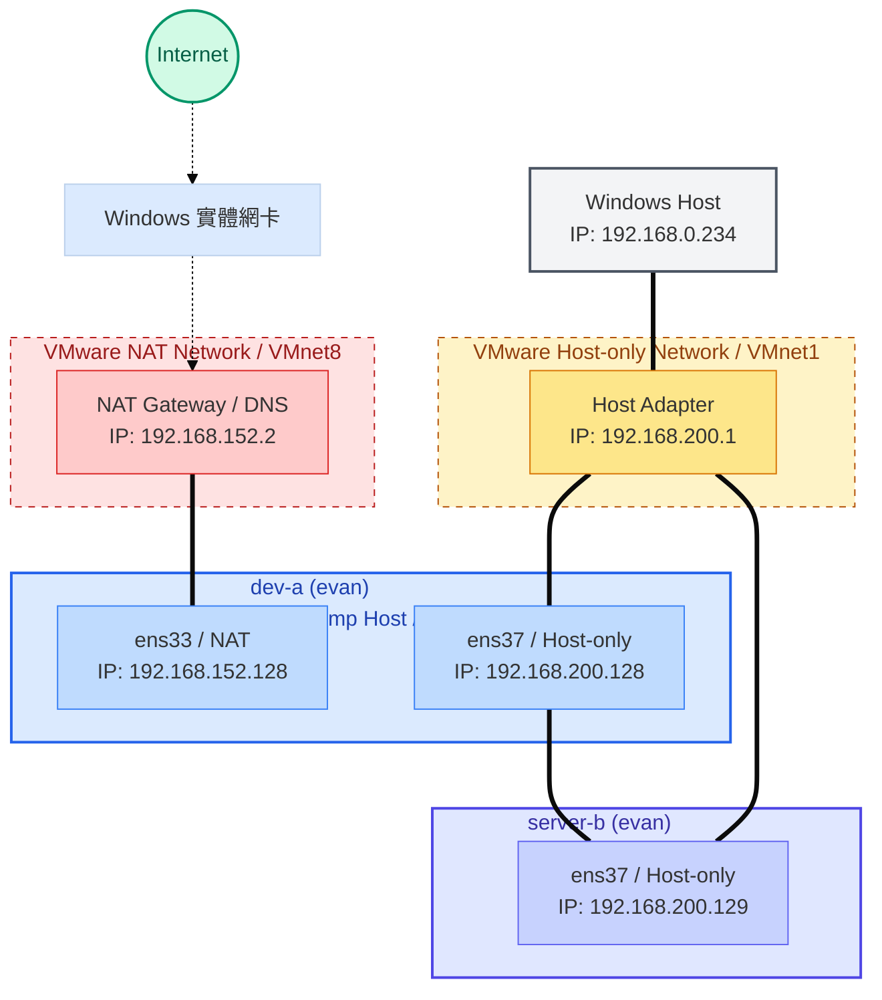

```mermaid
%%{init: {'theme': 'base', 'themeVariables': { 'primaryColor': '#dbeafe', 'edgeLabelBackground':'#ffffff', 'tertiaryColor': '#fff'}}}%%
flowchart TB
    %% 外部網路與 Host
    Internet((Internet))
    WindowsHost["Windows Host<br/>IP: 192.168.0.234"]

    %% VMware 虛擬網路
    subgraph VMnet8["VMware NAT Network / VMnet8"]
        direction LR
        VMnet8_GW["NAT Gateway / DNS<br/>IP: 192.168.152.2"]
    end

    subgraph VMnet1["VMware Host-only Network / VMnet1"]
        direction LR
        VMnet1_Adapter["Host Adapter<br/>IP: 192.168.200.1"]
    end

    %% 虛擬機
    subgraph DEVA["dev-a (evan)<br/>Role: Jump Host / Docker"]
        direction TB
        DEVA_Ens33["ens33 / NAT<br/>IP: 192.168.152.128"]
        DEVA_Ens37["ens37 / Host-only<br/>IP: 192.168.200.128"]
    end

    subgraph SRVB["server-b (evan)<br/>Role: Isolated Application"]
        direction TB
        SRVB_Ens37["ens37 / Host-only<br/>IP: 192.168.200.129"]
    end

    %% 連線流量
    Internet -.-> HOST_CONN["Windows 實體網卡"]
    HOST_CONN -.-> VMnet8_GW
    VMnet8_GW === DEVA_Ens33

    WindowsHost === VMnet1_Adapter
    VMnet1_Adapter === DEVA_Ens37
    VMnet1_Adapter === SRVB_Ens37

    DEVA_Ens37 === SRVB_Ens37

    %% 樣式設定
    style Internet fill:#d1fae5,stroke:#059669,stroke-width:2px,color:#065f46
    style WindowsHost fill:#f3f4f6,stroke:#4b5563,stroke-width:2px
    style VMnet8 fill:#fee2e2,stroke:#b91c1c,stroke-width:1px,stroke-dasharray: 5 5,color:#991b1b
    style VMnet1 fill:#fef3c7,stroke:#b45309,stroke-width:1px,stroke-dasharray: 5 5,color:#92400e
    style VMnet8_GW fill:#fecaca,stroke:#dc2626
    style VMnet1_Adapter fill:#fde68a,stroke:#d97706
    style DEVA fill:#dbeafe,stroke:#2563eb,stroke-width:2px,color:#1e40af
    style SRVB fill:#e0e7ff,stroke:#4f46e5,stroke-width:2px,color:#3730a3
    style DEVA_Ens33 fill:#bfdbfe,stroke:#3b82f6
    style DEVA_Ens37 fill:#bfdbfe,stroke:#3b82f6
    style SRVB_Ens37 fill:#c7d2fe,stroke:#6366f1
```
