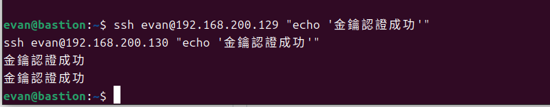
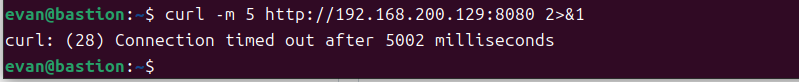
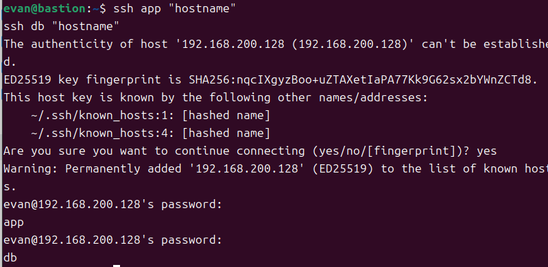
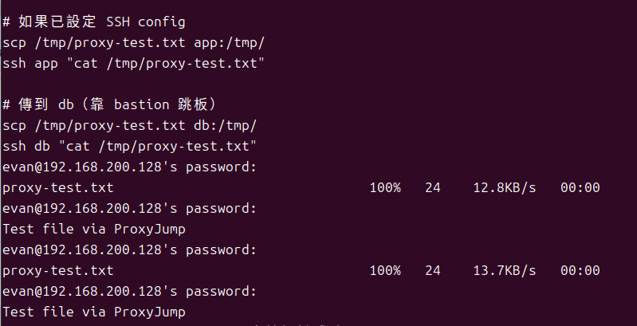

# W03｜多 VM 架構：分層管理與最小暴露設計

## 網路配置

| VM | 角色 | 網卡 | 模式 | IP | 開放埠與來源 |
|---|---|---|---|---|---|
| bastion | 跳板機 | NIC 1 | NAT | 192.168.152.128 | SSH from any |
| bastion | 跳板機 | NIC 2 | Host-only | 192.168.200.128 | — |
| app | 應用層 | NIC 1 | Host-only | 192.168.200.129 | SSH from 192.168.56.0/24 |
| db | 資料層 | NIC 1 | Host-only | 192.168.200.130 | SSH from app + bastion |

## SSH 金鑰認證

- 金鑰類型: ed25519
- 公鑰部署到：~/.ssh/authorized_keys
- 免密碼登入驗證：
  - bastion → app：
  - bastion → db：
  - 

## 防火牆規則

### app 的 ufw status
（貼上 `sudo ufw status verbose` 輸出）

### db 的 ufw status
（貼上 `sudo ufw status verbose` 輸出）

### 防火牆確實在擋的證據

## ProxyJump 跳板連線
- 指令：evan@bastion:~$ mkdir -p ~/.ssh
cat >> ~/.ssh/config << 'EOF'
Host bastion
    HostName 192.168.200.128       
    User evan          

Host app
    HostName 192.168.200.129   
    User evan      
    ProxyJump bastion

Host db
    HostName 192.168.200.130  
    User evan     
    ProxyJump bastion
EOF

chmod 600 ~/.ssh/config

- 驗證輸出：

- SCP 傳檔驗證：

## 故障場景一：防火牆全封鎖

| 項目 | 故障前 | 故障中 | 回復後 |
|---|---|---|---|
| app ufw status | active + rules | deny all | active (allow 22) |
| bastion ping app | 成功 | 失敗 (Request timeout) | 成功 |
| bastion SSH app | 成功 | **timed out** | 成功 |

## 故障場景二：SSH 服務停止

| 項目 | 故障前 | 故障中 | 回復後 |
|---|---|---|---|
| ss -tlnp \| grep :22 | 有監聽 | 無監聽 | 有監聽 |
| bastion ping app | 成功 | 成功 | 成功 |
| bastion SSH app | 成功 | **refused** | 成功 |

## timeout vs refused 差異
* **Timeout (逾時)**：封包發出去後沒人鳥我。這通常代表「網路層」斷了，或是防火牆 (UFW) 設成 `DROP` 模式把封包直接丟掉，導致我不知道對方到底在不在。
* **Refused (被拒絕)**：對方有回應，但是說被拒絕。這代表網路通了（所以 Ping 會過），但「應用層」出事，目標主機的 SSH 服務 (sshd) 根本沒開。

## 網路拓樸圖

## 排錯紀錄
- **症狀**：從 Windows 下指令 `ssh bastion` 或 `ssh app` 時一直要求輸入 `maste` 帳號的密碼，即便已經佈署過公鑰也無效。連線 `db` 時出現 `Timeout`。
- **診斷**：
    1. 執行 `ssh -G bastion` 發現 Windows 預設使用目前系統登入名 `maste`，而非 VM 的使用者 `evan`。
    2. 檢查 `~/.ssh/known_hosts` 發現 `app` 與 `bastion` 具有重複的 Fingerprint，確認是 Clone VM 導致的身分辨識混淆。
    3. 確認 `app` 與 `db` 位於 Host-only 網段，Windows 無法直連。
- **修正**：
    1. 在 Windows 端手動建立 `~/.ssh/config` 檔案，明確定義 `User evan` 並設定 `ProxyJump bastion`。
    2. 執行 `sudo systemctl mask sleep.target` 解決虛擬機頻繁黑屏休眠導致的斷聯問題。
- **驗證**：在 Windows CMD 執行 `ssh app "hostname"`，可直接穿過跳板機回傳結果，無需手動輸入密碼。

## 設計決策
**選擇：強制所有內網機 (App/DB) 僅能透過 Bastion 進行 ProxyJump 存取。**
* **取捨**：雖然這樣在 Windows 端需要額外配置 SSH Config，不像直連那麼直觀，但大幅提升了安全性。
* **原因**：為了模擬真實企業環境，將資料庫與應用程式放在不具外網 IP 的 Host-only 網段，僅保留一台 Bastion 作為對外窗口，可以集中管理金鑰並防止資料庫直接暴露在潛在的掃描威脅中。
