# W04｜Linux 系統基礎：檔案系統、權限、程序與服務管理

## FHS 路徑表

| FHS 路徑 | FHS 定義 | Docker 用途 |
|---|---|---|
| /etc/docker/ | （填入） | （填入） |
| /var/lib/docker/ | （填入） | （填入） |
| /usr/bin/docker | （填入） | （填入） |
| /run/docker.sock | （填入） | （填入） |

## Docker 系統資訊

- Storage Driver：overlayfs
- Docker Root Dir：/var/lib/docker
- 拉取映像前 /var/lib/docker/ 大小：236K
- 拉取映像後 /var/lib/docker/ 大小：240K

## 權限結構

### Docker Socket 權限解讀
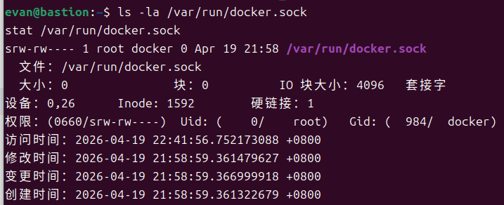

### 使用者群組
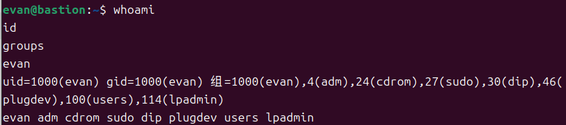

### 安全意涵
（用自己的話說明為什麼 docker group ≈ root，安全示範的觀察結果）

## 程序與服務管理

### systemctl status docker
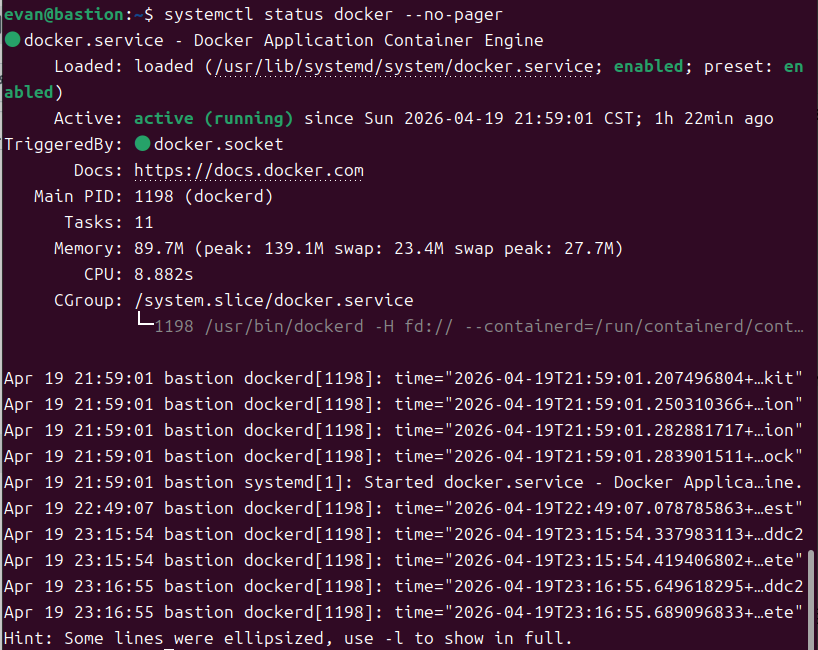

### journalctl 日誌分析
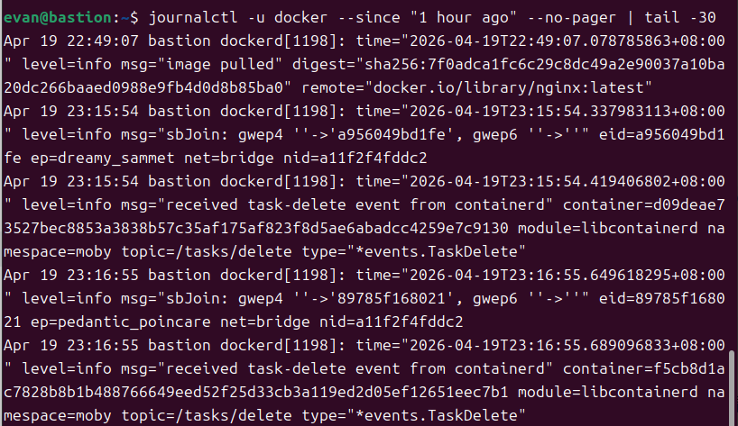
- 日誌分析摘要：

    - 觀察到的事件：記錄了 image pulled (拉取 nginx 映像檔)、網路介面建立 sbJoin (容器啟動)、以及 received task-delete (容器執行完畢後被刪除)。

    - 結論：日誌顯示 Docker Daemon 運作正常，且能正確響應 docker run --rm 指令的生命週期管理。當前使用的 Daemon PID 為 1198。

### CLI vs Daemon 差異
（用自己的話說明兩者的差異，為什麼 `docker --version` 正常不代表 Docker 能用）

## 環境變數

- $PATH：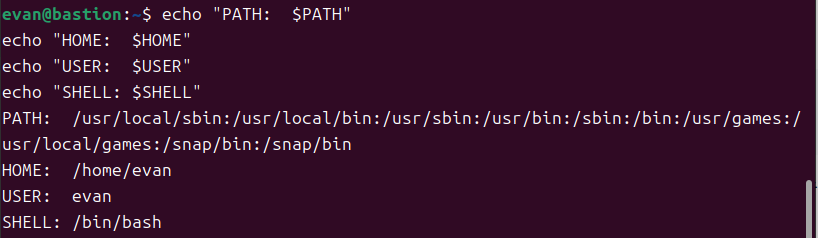
- which docker：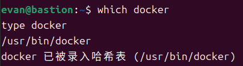
- 容器內外環境變數差異觀察：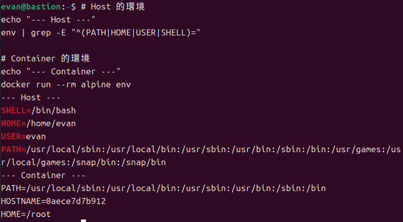
- （簡述）

## 故障場景一：停止 Docker Daemon

| 項目 | 故障前 | 故障中 | 回復後 |
|---|---|---|---|
| systemctl status docker | active | （填入） | （填入） |
| docker --version | 正常 | （填入） | （填入） |
| docker ps | 正常 | Cannot connect | （填入） |
| ps aux grep dockerd | 有 process | （填入） | （填入） |

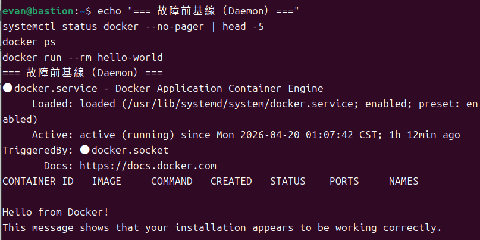
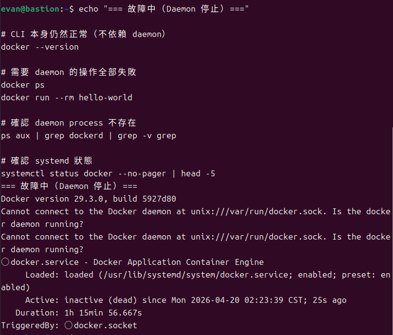
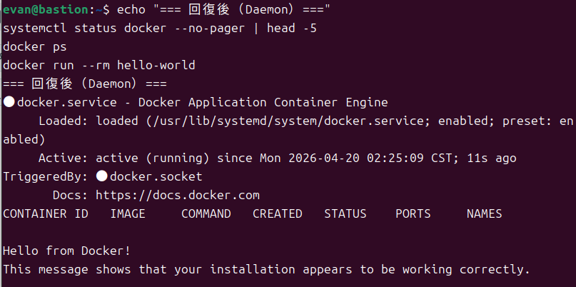

## 故障場景二：破壞 Socket 權限

| 項目 | 故障前 | 故障中 | 回復後 |
|---|---|---|---|
| ls -la docker.sock 權限 | srw-rw---- | （填入） | （填入） |
| docker ps（不加 sudo） | 正常 | permission denied | （填入） |
| sudo docker ps | 正常 | （填入） | （填入） |
| systemctl status docker | active | （填入） | （填入） |

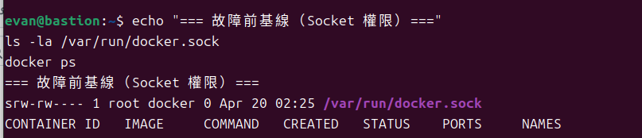
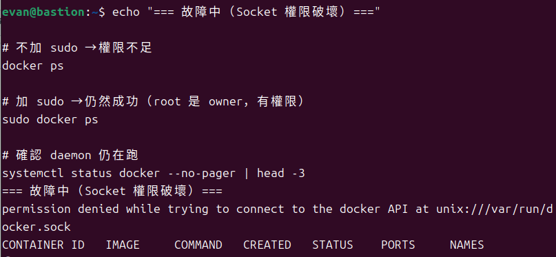
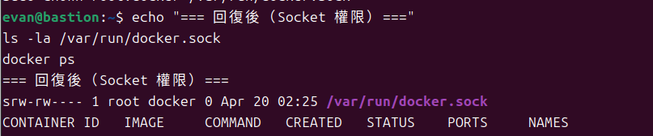

## 錯誤訊息比較

| 錯誤訊息 | 根因 | 診斷方向 |
|---|---|---|
| Cannot connect to the Docker daemon | （填入） | （填入） |
| permission denied…docker.sock | （填入） | （填入） |

（用自己的話說明兩種錯誤的差異，各自指向什麼排錯方向）

## 排錯紀錄
- 症狀：
- 診斷：（你首先查了什麼？）
- 修正：（做了什麼改動？）
- 驗證：（如何確認修正有效？）

## 設計決策
（說明本週至少 1 個技術選擇與取捨，例如：為什麼教學環境用 `usermod` 加 group 而不是每次 sudo？這個選擇的風險是什麼？）
