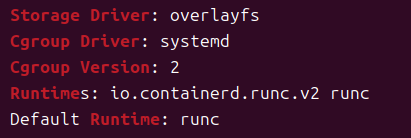
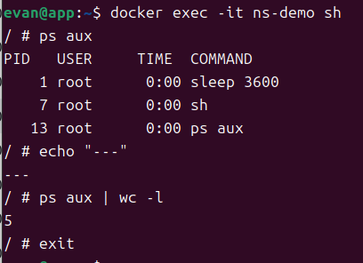

# W05｜把容器拆開來看：Namespace / Cgroups / Union FS / OCI

## Docker 環境



## Namespace 觀察

### 六種 namespace 用途（用自己的話）
- **PID**：隔離 Process ID 空間。讓容器擁有自己獨立的 PID 計數（例如容器內可以有自己的 PID 1），同時無法看到 Host 或其他容器的程序。
- **NET**：隔離網路裝置、IP、路由表、Port 與防火牆規則（iptables）。讓容器擁有自己獨立的網路協定堆疊（如獨立的 `lo` 與 `eth0`）。
- **MNT**：隔離 Mount Point（掛載點）。讓容器擁有自己獨立的檔案系統根目錄（`/`），看不到 Host 上的其他實體路徑。
- **UTS**：隔離 Hostname 與 Domain name。讓容器可以修改自己的主機名稱（例如變成 Container ID）而不影響到外部的 Linux 主機。
- **IPC**：隔離 System V IPC 與 POSIX 訊息佇列。防止不同容器之間透過共享記憶體、信號量（Semaphore）等機制發生跨容器通訊。
- **USER**：隔離 User 與 Group ID（使用者與群組）。允許容器內部的 root 使用者（UID 0）對映到 Host 上的一個普通無權限使用者，提升資安防護。

### Host vs 容器 inode 對照
| Namespace | Host PID 1 inode | 容器 sleep inode | 一樣嗎？ |
|---|---|---|---|
| pid |4026532559|4026531836|不一樣|
| net |4026532561|4026531833|不一樣|
| mnt |4026532556|4026531832|不一樣|
| uts |4026532557|4026531838|不一樣|
| ipc |4026532558|4026531839|不一樣|
| user |4026531837|4026531837|一樣|

### 容器內 `ps aux` 輸出


#### （只看到幾支 process？為什麼？）
**答**：因為 **PID Namespace** 發揮了隔離效果。容器內的 `ps aux` 只能看到屬於該 Namespace 底下的程序（例如 `sleep 3600` 作為 PID 1，以及執行指令時產生的 `ps` 本身）。Host 上其餘上百個系統程序（如 systemd、ssh 等）在容器的視角裡是被完全隱藏且不可見的。

---

## Cgroups 實驗

### 容器內讀到的限制
- memory.max：268435456
- cpu.max：50000 100000

### Host 端對照（用 `docker inspect -f '{{.HostConfig.CgroupParent}}'` 動態取得路徑）
- memory.max：268435456
- cpu.max：50000 100000
- memory.current（執行時某一刻）：401408

### OOM 故障三階段
| 項目 | 故障前 | 故障中（memory=32m + dd 200m）| 回復後（memory=256m）|
|---|---|---|---|
| 容器 exit code | - | **137** | **0** |
| OOMKilled | - | **true** | **false** |
| dmesg 關鍵字 | 無 OOM | **Memory cgroup out of memory: Killed process** | 無 OOM |

---

## Image 分層

### `docker image inspect` 實測 layer 數量
在本地環境中對不同版本的 Nginx Alpine 映像檔進行分析，結果如下：
1. **`nginx:1.27-alpine`** 共有 **8** 層。
2. **`nginx:1.26-alpine`** 共有 **8** 層。

實體雜湊值對照：
#### nginx:1.27-alpine 的 Layer 列表：
```json
[
  "sha256:08000c18d16dadf9553d747a58cf44023423a9ab010aab96cf263d2216b8b350",
  "sha256:d71eae0084c1aa823dd8fb2ecf8604d5c0f4911226c042bb1f8297e819f4b192",
  "sha256:c56f134d380585340a68d0db2f2c170641a1c0ff72ccf2438cf2f693df756a85",
  "sha256:e244aa659f612a80c40dd8645812301e3def6b15ec67b9e486ed2201172b51d1",
  "sha256:b8d7d1d2263425d6044e059b2810017d062d659b9b755241f3747eda77726250",
  "sha256:811a4dbbf4a5309e4390cf655c12db92e1a4304fb9d9731f83e7b02e95a617c6",
  "sha256:947e805a4ac71f68e6703550c0b36c2aa2e554c4fa670ca2da6a25c6d7dccb66",
  "sha256:0d853d50b128aa460b47e7121849463a14b18d4fd976caf5014744aae24d28aa"
]
```
#### nginx:1.27-alpine 的 Layer 列表：
```json
[
  "sha256:994456c4fd7b2b87346a81961efb4ce945a39592d32e0762b38768bca7c7d085",
  "sha256:aad7be8b43d91f43cdc23af3440b13eea7c2957feec9c46c977cb256e92481f6",
  "sha256:49c50d3fe9320c2fc37d1aee38488bad246a680333a20746a5ef63f21d074c67",
  "sha256:ed2f467e1cfcfea2cff2f48b21b86e763979ee599591f3632b44899f26ce583b",
  "sha256:6f197061abd698a3eaf862a101d043b50b9162024cdf830e7cfb75131a9f3725",
  "sha256:51b6aefac2f5df9fa2c24d782ef818b0b96238af2511eb60f79a58d1c839513a",
  "sha256:6dba76576010ad0450285be4d174f5084b0bf597a68f31f8ad597fab0f032f3d",
  "sha256:a0636672c7fc32af4d1022152a8e32256abd648fb01f48f33023839e65c6d1cb"
]
```
### 兩個同源 image 共享 layer 的證據
（前幾個 sha256 是否相同？）
**答**：經實測對比，nginx:1.27-alpine 與 nginx:1.26-alpine 的每一層 sha256 雜湊值完全不同。
深入原因解讀：

雖然這兩個映像檔都屬於 Nginx 官方維護的 Alpine 分支，但由於主版本號不同（1.27 vs 1.26），官方在建置時使用了不同時期的 Alpine OS 基礎底座（例如 Alpine 3.20 與 3.19）。

根據 Docker Union FS 的內容定址（Content-Addressable Storage）原理：

    只要底層作業系統的檔案、安全性補丁、軟體包版號有一絲一毫的改變，打包出來的 Layer 內容就會改變。

    內容一變，計算出來的 sha256 雜湊值就會完全不相符。

這項實驗結果強力證實了：Docker 的分層共享極度嚴謹。它不是單純看名字「同源」就共享，而是必須「內容百分之百一模一樣（sha256 相同）」才會在實體磁碟中共用空間。不同時期編譯出來的核心基礎層，會被當作完全不同的個體獨立儲存。

### `docker diff` 輸出範例與解讀
- **C** /etc
- **A** /tmp/hello.txt
- **D** /etc/nginx/conf.d/default.conf
#### 解讀：
- **A (Added)**：代表在容器的可寫層（Upperdir）中**新增**了檔案（例如新增了 `/tmp/hello.txt`）。
- **C (Changed)**：代表該目錄或檔案的結構/屬性被**修改**過（例如 `/etc` 目錄下有檔案變動，導致目錄結構更新）。
- **D (Deleted)**：代表原本唯讀層（Lowerdir）的檔案在容器中被**刪除**了（例如刪除了 `/etc/nginx/conf.d/default.conf`）。在底層，Overlay2 會透過建立一個特殊檔案（whiteout 檔案）來遮蔽下層檔案，使其在容器中消失，但原本 Image 唯讀層的實體檔案並未真正被抹除。

---

## OCI 呼叫鏈

### 角色職責說明
當我們執行 `docker run` 時，會觸發以下呼叫鏈：
1. **dockerd**：最上層的守護程序，提供高階的使用者 REST API，處理網路調度、Volume 挂載與鏡像管理等宏觀邏輯。
2. **containerd**：高階容器運行時，負責管理容器的生命週期、映像檔的下載解壓、以及快照（Snapshot）管理。它不直接操作 Kernel，而是向下呼叫 gRPC。
3. **containerd-shim**：每個容器都會配置一個獨立的 shim 程序。它的職責是作為管線，持續持有容器的標準輸入輸出（stdio）、收集退出狀態碼（Exit Code），即使 `dockerd` 或 `containerd` 崩潰或重啟，容器 process 也能安穩運行不受影響。
4. **runc**：低階運行時（OCI Runtime 的參考實作）。它是一支短命程序，負責依照規範執行最底層的 Linux 系統呼叫（如 `clone()`、`unshare()`）建立 Namespace，並將限制值寫入 Cgroup，最後將程序 `exec` 替換為用戶指定的容器程序。跑完後 `runc` 即功成身退。

### `config.json` 欄位對應
OCI Runtime Spec 的 `config.json` 定義了容器的構造：
- **`linux.namespaces`**：這個陣列欄位定義了容器啟動時，核心需要建立並解耦哪些 Namespace（如 `{"type": "pid"}`, `{"type": "network"}`）。
- **`linux.resources`**：此欄位直接對應到 **Cgroup** 的資源限制，裡面會包含 `memory.limit`、`cpu.shares`、`cpu.cfs_quota_us`（cgroup v1）或 `memory.max`、`cpu.max`（cgroup v2）等寫入參數。

---

## 排錯紀錄
- **症狀**：在 App VM 中執行 `git clone` 嘗試取得遠端 GitHub 倉庫時，系統拋出錯誤訊息：`fatal: 无法访问 ... Could not resolve host: github.com`。
- **診斷**：根據 W03 三節點架構設計，App VM 的網路卡被設定為 **Host-Only** 模式（IP 網段為 `192.168.200.x`）。此網段為高度隔離的內部純淨區，不具備網際網路閘道（Gateway）與外部 DNS 解析能力，因此無法與外網通訊。
- **修正**：nah I just do it on github,its easier for me.

---

## 想一想（回答 3 題）

### 1. 容器裡的 PID 1 跟 host PID 1 是同一支 process 嗎？`kill -9 1`（在容器內）會發生什麼？
**答**：
- **不是同一支程序**。Host 上的 PID 1 通常是作業系統的初始化系統（如 `systemd`）；而容器內的 PID 1 只是主機上的一個普通程序（如 `sleep`），只是因為被塞進了獨立的 PID Namespace，所以在容器的視角中它的識別碼被對映成了 1。
- 在容器內執行 `kill -9 1` **預設不會發生任何事**。Linux Kernel 對於 Namespace 內的 PID 1 有特殊的保護機制，會主動忽略該 Namespace 內部發出的 `SIGKILL` 訊號，防止容器內部的核心程序被意外終止。除非該訊號是從 Host（外部視角）向容器實體 PID 發出的，容器才會被關閉。

### 2. 兩個容器都基於 `ubuntu:24.04`，磁碟空間是吃兩份還是共用？怎麼驗證？
**答**：
- **大部分是共用的**。透過 Union FS（Overlay2）機制，`ubuntu:24.04` 鏡像檔中的所有唯讀層（Lowerdir）在硬碟中只會儲存一份實體檔案。兩個容器各自啟動時，只會分別獲配一個極小的可寫層（Upperdir）來記錄各自的修改。
- **驗證方式**：可以在建立多個同源容器前後，執行 `df -h` 或 `sudo du -sh /var/lib/docker/overlay2/` 觀察實體磁碟容量的增長。你會發現，不論啟動多少個容器，該目錄的空間增加量都遠小於映像檔本身的大小，增加的僅是各容器微量的運行日誌與可寫層變動。

### 3. 如果 host 的 kernel 爆漏洞，容器還能稱為「隔離」嗎？這個限制跟 VM 差在哪？
**答**：
- **無法保證絕對隔離**。因為容器本質上是**共用 Host Kernel** 的一組程序（Process），中間並沒有虛擬化硬體層的安全屏障。一旦 Host Kernel 發生嚴重的權限提升（Privilege Escalation）漏洞，容器內的惡意程式就能利用該漏洞實現「容器逃逸（Container Escape）」，直接接管整台實體主機。
- **與 VM 的差別**：虛擬機（VM）擁有**獨立的 Guest OS Kernel**，與主機之間隔著一層 Hypervisor（虛擬化硬體層）。除非 Hypervisor 本身爆出漏洞，否則即使 VM 內的核心被攻破，也無法輕易波及外部 Host。因此 VM 的安全邊界是「硬體級」的，而容器的安全邊界是「程序視角級」的。
