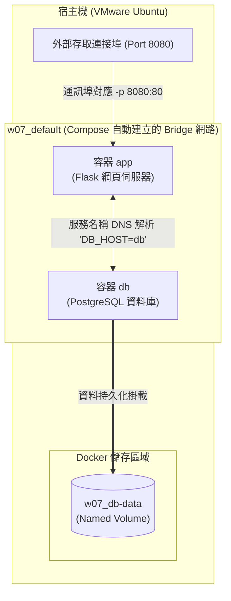

# W07｜Docker Compose 與資料持久化

## 拓樸圖

### 1. Mermaid 動態架構圖

## 從 docker run 到 compose.yaml
以前期中考需要手動一條一條敲 docker network create、docker volume create 以及帶有一堆環境變數與長路徑的 docker run，步驟繁瑣且只要漏抄一個參數或錯字，服務就完全連不起來。
改用 compose.yaml 宣告式管理後，所有的網路拓樸、硬碟掛載、環境變數全部集中定義在一份藍圖中。現在只需要執行單一命令 docker compose up -d，Docker 就能自動管網路、自動排順序、自動清現場，達到 100% 的可重現性，再也不用擔心筆記漏抄指令了

## 三種掛載對照
| 掛載類型 | 路徑（host） | 容器砍重起資料還在嗎 | 重啟容器資料狀態 | 適合情境 |
|---|---|---|---|---|
| **named volume** | `/var/lib/docker/volumes/w07_db-data/_data` (由 Docker 內部統一託管的專屬區域) | **在** (除非手動下 `down -v` 否則不會消失) | 完美保留，資料庫重啟後先前的資料表與數據皆完好如初。 | **生產環境（Production）的資料庫儲存**，兼顧高效能與資料安全性。 |
| **bind mount** | `./app` (目前專案目錄下的實際實體路徑) | **在** (資料本來就存在 Host 主機硬碟上) | 與 Host 雙向實時同步，主機改 code 容器內部立刻生效。 | **本地開發階段（Development）**，方便即時調試程式碼，不需反覆 Rebuild。 |
| **tmpfs** | 無實體硬碟路徑 (僅存在於宿主機的記憶體 RAM 中) | **不在** (容器一旦停止或重啟資料立刻蒸發) | 完全清空，重啟後該掛載目錄會恢復到最初的初始空狀態。 | **高安全性敏感暫存**（如臨時 Session 快取、金鑰），確保主機硬碟不留痕跡。 |

## healthcheck 前後對照
| 寫法 | curl /healthz t=1s | t=3s | t=5s | t=10s |
|---|---|---|---|---|
| **只 depends_on** | 503 (db unreachable) | 503 (db unreachable) | 200 (ok) | 200 (ok) |
| **service_healthy** | Connection Refused | Connection Refused | 200 (ok) | 200 (ok) |

### 觀察與分析：
1. **只使用 `depends_on` 的痛點**：
   當只寫 `depends_on: - db` 時，Docker 只要看到 db 容器「開機了」就會立刻啟動 app 容器。但此時 PostgreSQL 內部其實還在進行繁瑣的資料庫初始化與密碼配置（通常需要 3~5 秒），根本還無法接收連線。因此在前面幾秒（t=1s, t=3s）去 `curl` 網頁時，App 就會因為連不到資料庫而瘋狂噴出 **503 (db unreachable)** 錯誤。
2. **加入 `service_healthy` 的改善**：
   加上 `healthcheck` 探測機制後，app 容器會被強制在背景「按兵不動」，直到 db 容器內部真正就緒、並回報 `healthy` 狀態後，app 才會正式放行啟動。雖然前幾秒（t=1s, t=3s）因為 app 還沒開好對外顯示 **Connection Refused（拒絕連線）**，但**一旦服務順利開起來（t=5s），使用者點進網頁就絕對是 100% 正常的 200 OK**。這徹底解決了微服務之間因為啟動時間差所導致的連線撞牆衝突！

## 排錯紀錄
* **症狀**：第一次啟動並執行 `curl http://localhost:8080/` 時，網頁一直報出 503 錯誤，查看後台日誌，發現 `app` 容器拋出錯誤：`psycopg2.OperationalError: connection to server at "db" (172.18.0.2), port 5432 failed: Connection refused` 並不斷重啟。
* **診斷**：經檢查發現是因為 `compose.yaml` 中，`app` 的 `depends_on` 只寫了第一版的 `- db`。雖然 Docker Engine 順利讓 `db` 容器跑了起來，但 PostgreSQL 內部在第一次啟動時，需要進行初始化、配置資料庫與密碼設定（需要花費約 3~5 秒）。在這段時間窗口內，PostgreSQL 尚未開啟 5432 連接埠，而 `app` 太早起飛連線，導致直接撞牆出錯。
* **修正**：在 `db` 服務區塊補上 `healthcheck` 配置（利用 `pg_isready -U postgres` 進行探測），並修改 `app` 的依賴長格式，強制指定 `condition: service_healthy`。
* **驗證**：執行 `docker compose down -v` 清理現場後重新 `docker compose up -d`，透過 `docker compose ps` 觀察到 `app` 容器會乖乖維持在等待狀態，直到 `db` 顯示為 `(healthy)` 後才開始啟動。此時再度 `curl` 存取，第一次就直接拿到 `200 OK` 與資料庫時間，順利修復！

## 設計決策
* **為什麼 db 用 named volume 而不是 bind mount？**
  PostgreSQL 這種關聯式資料庫在執行時，對於底層檔案系統的檔案鎖（File Locking）、Linux 權限（UID/GID）以及讀寫效能（I/O Performance）有著極度嚴格的要求。Bind mount 會使容器內部的資料目錄直接暴露並受控於宿主機（Host）的檔案系統與作業系統限制，極易引發權限不符（Permission Denied）或死鎖問題；而 Named Volume 完全交由 Docker 引擎在 Linux 專屬區域高效能託管，能提供資料庫最穩定、安全的運行環境。
* **為什麼不能在生產環境用 tmpfs 存資料庫？**
  因為 tmpfs 是將所有資料完全儲存在隨機存取記憶體（RAM）中。記憶體屬於揮發性儲存媒體，一旦遇到容器重啟、伺服器突發性斷電、或硬體維護重開機，記憶體內的所有資料將會**在一瞬間徹底蒸發、永久消失**。這對於強調資料必須絕對安全、不可遺失的生產環境資料庫來說，是絕對無法接受的致命災難。
